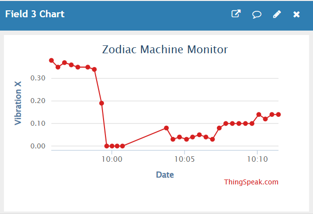
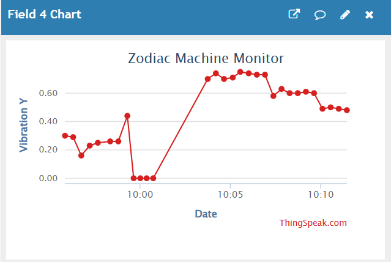
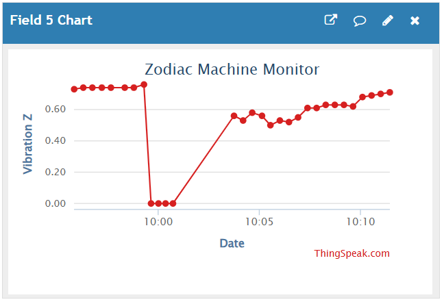
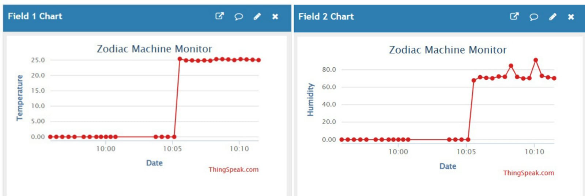

# 🏭 Industrial IoT Data Acquisition & Predictive Maintenance System

## 📋 Project Abstract
This project implements a robust **Industrial IoT (IIoT) Data Pipeline** designed for the health monitoring of rotating machinery (e.g., CNC spindles, Induction Motors). By leveraging **Edge Computing** on the STM32F446RE, the system captures, pre-processes, and transmits high-frequency telemetry data (Vibration, Temperature, Humidity) to a cloud backend.

The primary objective is to facilitate **Predictive Maintenance (PdM)** strategies by generating a high-fidelity time-series dataset capable of training Machine Learning models for anomaly detection and fault classification.

---

## 📊 Data Science & Analytics Relevance
This project serves as the **Data Engineering / Data Acquisition** layer for Industrial AI applications.

### 1. Edge-Level Feature Extraction
Instead of transmitting raw noisy signals, the **STM32 Cortex-M4** acts as an Edge Node, performing signal conditioning and data normalization locally. This reduces cloud latency and bandwidth usage—a critical requirement for scalable MLOps.

### 2. Time-Series Dataset Generation
The system generates a structured multivariate time-series dataset ideal for:
*   **Anomaly Detection:** Identifying outliers in vibration patterns (e.g., Isolation Forest).
*   **Forecasting:** Predicting thermal runaway using regression models (e.g., ARIMA/LSTM).
*   **Classification:** Distinguishing between mechanical looseness vs. imbalance based on axis-specific G-force deltas.

### 3. Real-Time Telemetry Visualization
Utilizes **ThingSpeak** for live dashboarding, mimicking industrial SCADA systems for operational technology (OT) analytics.

---

## 🛠 System Architecture

The data flow follows a standard IoT pipeline architecture: **Perception $\rightarrow$ Edge Processing $\rightarrow$ Network $\rightarrow$ Application**.

graph LR
    subgraph Source [Data Source]
        M(Industrial Motor)
    end

    subgraph Perception [Sensing Layer]
        A[ADXL345 (3-Axis Vibration)]
        T[DHT22 (Environmental)]
    end

    subgraph Edge [Edge Computing Node]
        STM[STM32F446RE ARM Cortex-M4 <i>Signal Pre-processing</i>]
    end

    subgraph Transport [Network Layer]
        ESP[ESP8266 Gateway <i>MQTT/HTTP Protocol</i>]
    end

    subgraph Cloud [Analytics Layer]
        TS[ThingSpeak Cloud <i>Time-Series DB & Viz</i>]
    end

    M -.-> A & T
    A & T -->|I2C / GPIO| STM
    STM -->|UART| ESP
    ESP -->|TCP/IP| TS

## ⚙️ Technical Stack

| Layer | Technology Used | Description |
| :--- | :--- | :--- |
| **Edge Controller** | STM32 Nucleo-F446RE | 84MHz ARM Cortex-M4, Hardware FPU for decimal processing. |
| **Sensing** | MEMS ADXL345 | Digital Accelerometer ($\pm$4g range) for vibration capture. |
| **Environmental** | DHT22 | Precision temperature & humidity sensor for thermal profiling. |
| **Communication** | ESP8266 (ESP-01) | UART-to-WiFi Bridge using AT Command firmware. |
| **Cloud/Data** | ThingSpeak API | REST API for data ingestion and MATLAB-based visualization. |
| **Firmware** | Embedded C | Low-level drivers, Interrupt handling, and Memory Management. |

---

## 📂 Data Schema
The system streams a **5-dimensional vector** to the cloud every 16 seconds. This data can be exported as `.CSV` for model training.

| Feature Name | Data Type | Unit | Description |
| :--- | :--- | :--- | :--- |
| `Field 1` | Float | °C | Motor Surface Temperature |
| `Field 2` | Float | % | Ambient Humidity |
| `Field 3` | Float | g | Vibration - X Axis (Lateral) |
| `Field 4` | Float | g | Vibration - Y Axis (Axial) |
| `Field 5` | Float | g | Vibration - Z Axis (Vertical) |

---

## 🚀 Key Implementations
1.  **Critical Section Handling:** Implemented interrupt masking (`__disable_irq`) to ensure atomic operations during microsecond-level sensor reads, preventing race conditions.
2.  **Floating Point Optimization:** Configured the STM32 FPU and `newlib-nano` to efficiently handle decimal formatting for cloud transmission.
3.  **HMI Integration:** Concurrent operation of an I2C LCD for on-site operator feedback alongside the cloud telemetry stream.

---

## 📈 Data Visualization & Results
The system successfully streams telemetry data to the cloud. Below are the visualizations generated from the ThingSpeak API.

### 1. Vibration Analysis (X-Axis)
*Detects Lateral displacement and imbalance.*

### 2. Vibration Analysis (Y-Axis)
*Detects Axial displacement and shaft misalignment.*

### 3. Vibration Analysis (Z-Axis)
*Detects Vertical impact and structural looseness.*

### 4. Thermal Profiling
*Correlates Temperature rise with Humidity levels.*

> *Note: Spikes in the Z-Axis graph correspond to simulated mechanical unbalance events introduced during testing.*

---

## 🔌 Wiring Pinout
| Sensor Pin | STM32 Pin | Protocol |
|------------|-----------|----------|
| **ADXL SDA** | PB9 (D14) | I2C1 |
| **ADXL SCL** | PB8 (D15) | I2C1 |
| **DHT22 Data**| PB5 (D4) | GPIO |
| **ESP8266 RX** | PA9 (D8) | UART1 |
| **ESP8266 TX** | PA10 (D2) | UART1 |

---

## 🔮 Future Scope (AI/ML)
*   **On-Device FFT:** Implementing Fast Fourier Transform using the ARM CMSIS-DSP library to convert time-domain vibration data into frequency-domain for spectral fault signature analysis.
*   **Predictive Models:** Training a Linear Regression model on collected data to predict "Time to Failure" (RUL - Remaining Useful Life).

---

### 👥 Project Contributors

**Shivaprasad V Toggi** (Team Lead)  
*Lead Embedded Engineer & System Architect*

**Varun Gowda J**  
*Hardware Integration Specialist*

**Sneha K M**  
*Technical Research & Documentation Lead*

**Sinchana**  
*Data Visualization & Analytics Engineer*
